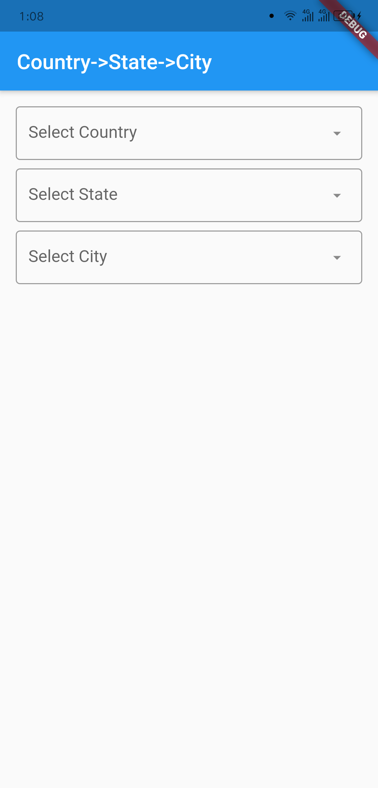
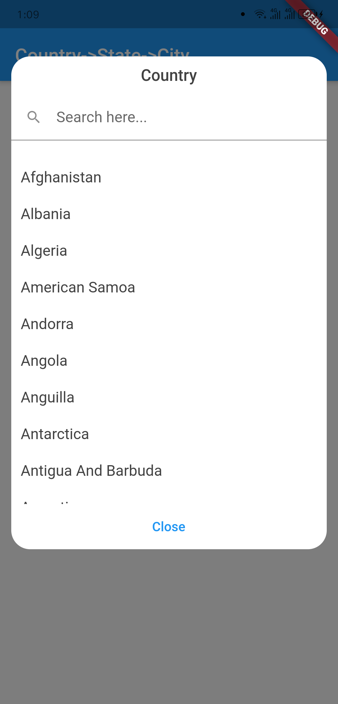
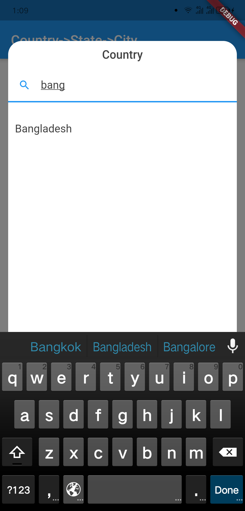
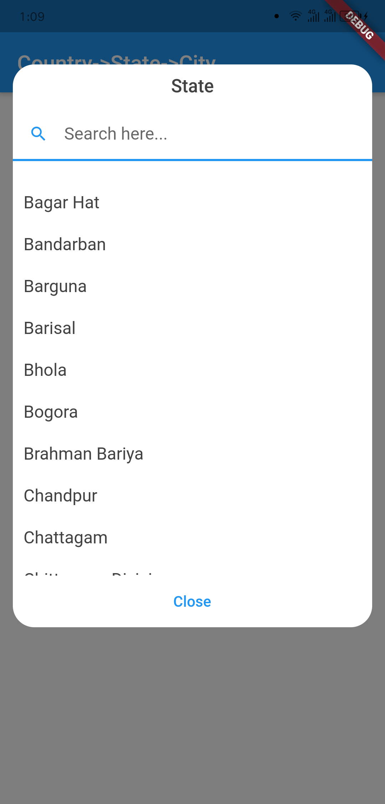
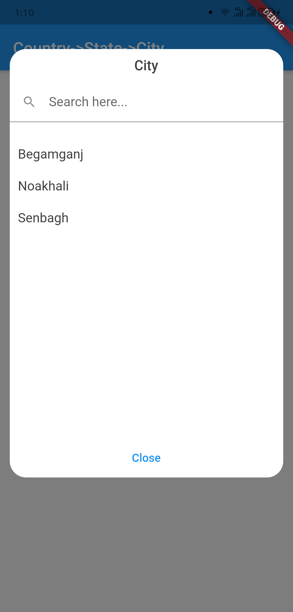
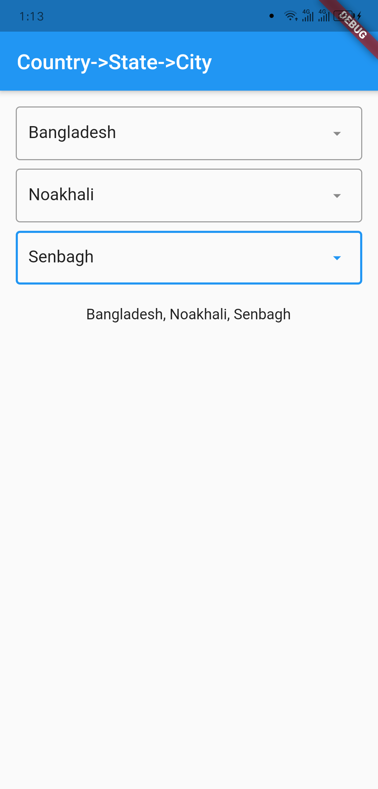

# state_city_pro 🌍


A Flutter package to select any  State → City from around the world.
- Built-in search for easy filtering.
- If a city is not found, the user can manually enter it in the dialog window.


## Getting Started

### Platforms:
✅ Supported Platforms: **Android**, **iOS**, and **Web (Chrome tested)**


## Screenshots
| Outlook                                   | Country Dialog                            |
|-------------------------------------------|-------------------------------------------|
|  |  |

| Country Searching                         | State Dialog                              |
|-------------------------------------------|-------------------------------------------|
|  |  |

| City Dialog                               | Final Data                                |
|-------------------------------------------|-------------------------------------------|
|  |  |


## Usage
```dart
import 'package:country_state_city/country_state_city_picker.dart';

///Define Controller
TextEditingController state=TextEditingController();
TextEditingController city=TextEditingController();

///Widget initialize
CountryStateCityPicker(
                state: state,
                city: city,
                dialogColor: Colors.grey.shade200,
                textFieldDecoration: InputDecoration(
                  fillColor: Colors.blueGrey.shade100,
                  filled: true,
                  suffixIcon: const Icon(Icons.arrow_downward_rounded),
                  border: const OutlineInputBorder(borderSide: BorderSide.none))
            ),
```

## Example Code
```dart
import 'package:flutter/material.dart';
import 'package:country_state_city/country_state_city_picker.dart';

void main() {
  runApp(MyApp());
}
class MyApp extends StatelessWidget {
  @override
  Widget build(BuildContext context) {
    return MaterialApp(
      title: 'Country->State->City',
      theme: ThemeData(
        primarySwatch: Colors.blue,
      ),
      home: HomePage(),
    );
  }
}

class HomePage extends StatefulWidget {
  @override
  _HomePageState createState() => _HomePageState();
}
class _HomePageState extends State<HomePage> {
  TextEditingController country=TextEditingController();
  TextEditingController state=TextEditingController();
  TextEditingController city=TextEditingController();
  @override
  Widget build(BuildContext context) {
    return Scaffold(
      appBar: AppBar(
        title: Text('State->City'),
      ),
      body: Padding(
          padding: EdgeInsets.all(15.0),
          child: Column(
            children: [
              CountryStateCityPicker(
                state: state,
                city: city,
                dialogColor: Colors.grey.shade200,
                textFieldDecoration: InputDecoration(
                   fillColor: Colors.blueGrey.shade100,
                   filled: true,
                   suffixIcon: const Icon(Icons.arrow_downward_rounded), 
                   border: const OutlineInputBorder(borderSide: BorderSide.none))
              ),
              SizedBox(height: 20),

              Text("${country.text}, ${state.text}, ${city.text}")
            ],
          )
      ),
    );
  }
}
```

## 📬 Connect
- 📧 [Email me](mailto:himanshunagose6264@gmail.com)
- 💻 [More projects on GitHub](https://github.com/himanshunagose)
